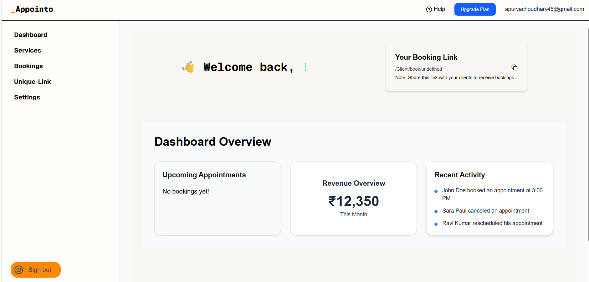

# 🗓️ Appointo — Smart Appointment Booking Platform

A modern full-stack appointment scheduling app that allows clients to book, manage, and track appointments seamlessly.

## 🧩 Overview

Appointo is a full-stack appointment booking platform built with **Next.js**, **Clerk**, and **MongoDB**.  
It allows clients to book and manage appointments effortlessly, while business owners can track and organize all bookings in one place.  

Built for freelancers, salons, and small businesses, Appointo focuses on **simplicity, speed, and a clean user experience**.  
Deployed seamlessly on **Vercel**, the platform also supports **secure sign-in**, **sharable booking links**, and **mobile-friendly design**.

## ✨ Features

- 🔐 **User Authentication** – Secure login and signup powered by Clerk.  
- 📅 **Appointment Booking** – Clients can easily book appointments using a unique sharable link.  
- 🧾 **Dynamic Client Pages** – Each client has a dedicated booking page with a unique slug.  
- 🌙 **Dark Mode Support** – Seamless automatic dark mode using Next.js global CSS.  
- 📱 **Responsive Design** – Optimized for desktop, tablet, and mobile devices.  
- 🚀 **Deployed on Vercel** – Fast and reliable production deployment.  
- 📤 **Link Sharing** – Copy and share booking URLs directly.  
- ⚡ **Next.js 14 App Router** – Modern routing, improved performance, and clean structure.

## 🧠 Tech Stack

**Framework:**  
- Next.js 14 (App Router) – Handles both frontend and backend via API routes  
- React.js  

**Styling & UI:**  
- Tailwind CSS  
- Framer Motion (for smooth animations)

**Database:**  
- MongoDB (via MongoDB Atlas)

**Authentication:**  
- Clerk

**Deployment & Hosting:**  
- Vercel

**Version Control:**  
- Git & GitHub

## ⚙️ Installation & Setup

1. **Clone the repository**

```bash
git clone https://github.com/your-username/appointo.git
cd appointo

2. **Install dependencies

npm install

3. **Set up environment variables

Create a .env.local file in the root directory and add:

NEXT_PUBLIC_CLERK_PUBLISHABLE_KEY=your_clerk_key
CLERK_SECRET_KEY=your_clerk_secret
MONGO_URI=your_mongo_connection_string

4. **Run the development server

npm run dev

5. **Open your browser

Visit 👉 http://localhost:3000

---

💡 **Tips:**
- Use numbered steps for clarity.  
- Keep `.env` keys general (never share real secrets).  
- Use code blocks for commands to improve readability.

---

## 🗂️ Folder Structure

appointo/
│
├── app/ # Next.js App Router directory
│ ├── layout.js # Root layout
│ ├── page.js # Landing page
│ ├── Client/ # Client-related pages
│ │ ├── book/[slug]/page.js # Dynamic booking page
│ │ └── dashboard/page.js # Client dashboard
│ ├── Admin/ # Admin-related pages
│ │ └── dashboard/page.js # Admin dashboard
│ └── api/ # API route handlers (backend logic)
│ ├── client/route.js
│ ├── booking/route.js
│ └── ...
│
├── components/ # Reusable UI components
│ ├── Navbar.jsx
│ ├── Footer.jsx
│ └── BookingForm.jsx
│
├── lib/ # Database and utility functions
│ └── connectDB.js
│
├── public/ # Static assets (images, icons, etc.)
│
├── styles/ # Global styles
│ └── globals.css
│
├── .env.local # Environment variables (not committed)
├── package.json
└── README.md

## 🌐 Live Demo

👉 [Visit Appointo](https://appointo-three.vercel.app/)

## 📸 Screenshots

### 🏠 Landing Page

### 🏠 Landing Page  


### 👤 Client Booking Page  


### 🧭 Admin Dashboard  


## 🤝 Contributing & Feedback

Contributions, issues, and feature requests are welcome!  

If you’d like to contribute:
1. Fork the repository  
2. Create a new branch (`git checkout -b feature-name`)  
3. Commit your changes (`git commit -m 'Add new feature'`)  
4. Push to your branch (`git push origin feature-name`)  
5. Open a Pull Request  

💬 Got feedback or suggestions?  
Feel free to connect with me directly on [LinkedIn](www.linkedin.com/in/apurva-singh-choudhary-374991223).

## 🧾 License

This project is licensed under the **MIT License** — see the [LICENSE](./LICENSE) file for details.

---

## 💡 Acknowledgements

- [Next.js](https://nextjs.org/) for the full-stack React framework  
- [Clerk](https://clerk.com/) for authentication  
- [MongoDB](https://www.mongodb.com/) for the database  
- [Vercel](https://vercel.com/) for deployment  

---

## 🚀 Final Thoughts

Appointo was built to simplify appointment scheduling with a modern, intuitive, and fast user experience.  
If you like this project, consider ⭐ starring the repo — it helps others discover it!


